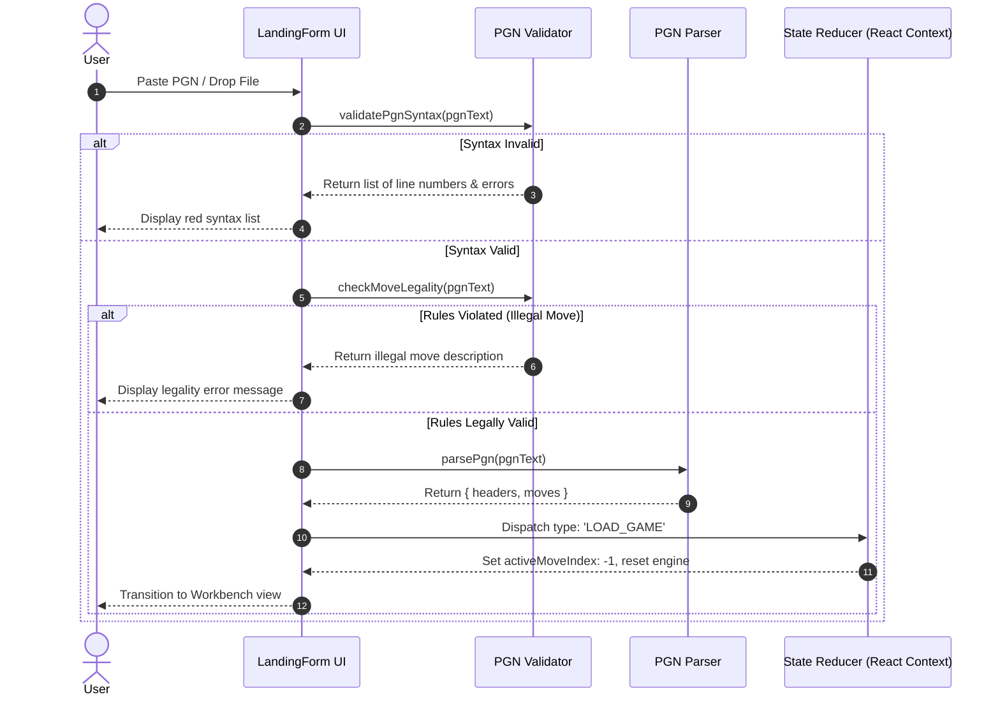
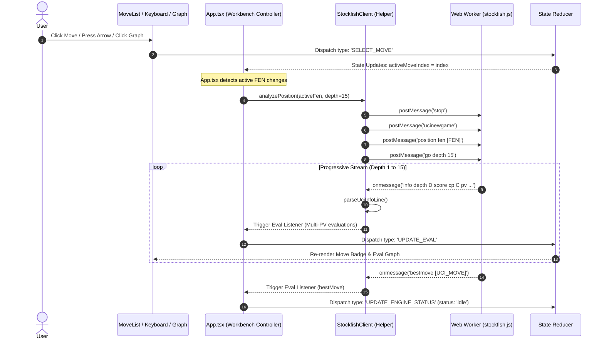
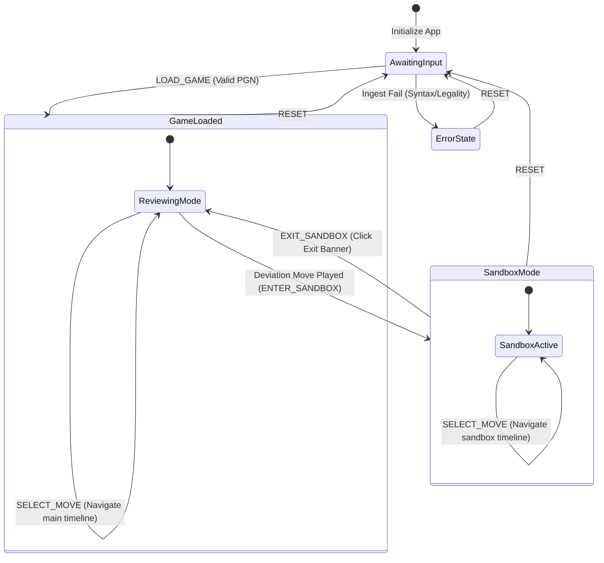

# Application Flow & State Transitions: CheckMate Analyze (v1.0.1)

This document maps the end-to-end data lifecycle, execution sequences, and state transition pathways within CheckMate Analyze. It details how the application moves from raw text ingestion to real-time engine feedback and interactive sandbox branching.

---

## 1. PGN Ingestion & Ingest Pipeline

The pipeline starts when a user inputs PGN data via paste or file upload. The system processes the input through syntax parsing, rules validation, and header extraction, ultimately updating the global state.

### Detailed Pipeline Actions:
1. **validatePgnSyntax:** Runs a regex and grammar scan. If brackets or move numbers are malformed, it flags the issue before loading the chess rules engine, preventing parser exceptions.
2. **checkMoveLegality:** Spawns a virtual chess board (`chess.js`) and plays through the moves sequentially. If any move violates FIDE rules (e.g. moving a pinned piece), parsing halts.
3. **parsePgn:** Maps the validated moves into an array of `MoveEntry` objects containing `ply`, `san`, `uci`, and `fen`.

---

## 2. Navigation & Local Engine Worker Loop

Once a game is loaded, navigation triggers the local Stockfish Web Worker. The engine evaluates the current board position and streams its findings back to the main thread.

### Protocol Execution Details:
* **`stop` Command:** Instantly cancels any calculations currently running on the worker. This ensures that rapid navigation doesn't queue up stale tasks.
* **`ucinewgame` Command:** Informs the engine to clear its internal hash tables and state history, preparing it for an independent lookup.
* **`position fen [FEN]`:** Sets the engine's internal board position to the active FEN string.
* **`go depth 15`:** Instructs the engine to perform a search up to depth 15 and stop.

---

## 3. "What-If" Sandbox Branching Flow

If the user plays a move on the board that deviates from the loaded game history, the application transitions into the Sandbox. This creates a temporary variation tree without overwriting the original game.

### Transition State Variables:

#### 1. Transition into Sandbox (`ENTER_SANDBOX`):
* **State Mutation:**
  * Copies main moves up to the current index: `sandboxMoves = moves.slice(0, activeMoveIndex + 1)`.
  * Appends the deviation move to `sandboxMoves` with the correct ply number.
  * Sets `isSandbox = true`.
  * Sets `sandboxActiveIndex = sandboxMoves.length - 1`.
* **Engine Redirect:** The engine's FEN target is shifted to the FEN of the newly played deviation move.

#### 2. Sandbox Navigation (`PLAY_SANDBOX_MOVE`):
* **State Mutation:** Appends the move to `sandboxMoves` from the current `sandboxActiveIndex`, discarding any trailing sandbox moves if the user had navigated backward before playing a new deviation.
* **Engine Redirect:** Analyzes the latest sandbox FEN.

#### 3. Exiting Sandbox (`EXIT_SANDBOX`):
* **State Mutation:**
  * Clears the sandbox variations: `sandboxMoves = []`.
  * Resets `sandboxActiveIndex = -1`.
  * Sets `isSandbox = false`.
* **Engine Redirect:** Directs Stockfish back to the FEN of `moves[activeMoveIndex]`.

---

**End of Application Flow & State Transitions**
