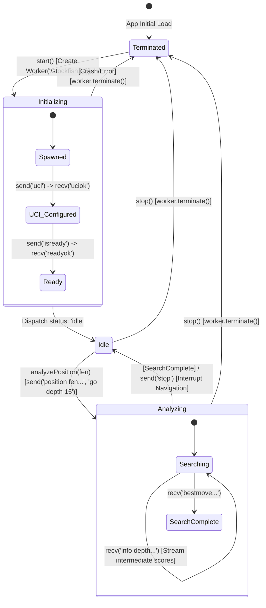

# Engine Pipeline Specification: CheckMate Analyze (v1.0.1)

This specification details the lifecycle, execution protocol, and synchronization mechanisms of the client-side Web Worker chess engine integration in CheckMate Analyze.

---

## 1. Thread Architecture & Web Worker Lifecycle

The chess analysis engine runs in a dedicated thread using the HTML5 Web Worker API. This isolates the CPU-heavy calculations of Stockfish from the browser's main UI thread, ensuring a constant 60fps frame rate for animations, drag-and-drop operations, and keyboard navigation.

### Worker Lifecycles & Transitions



### Protocol Thread Handshake Sequence

The communication between the main thread (`StockfishClient` class) and the Web Worker thread is performed using the asynchronous `postMessage` API. The payload is a raw text string, mapping to the Universal Chess Interface (UCI) protocol specifications.

---

## 2. Universal Chess Interface (UCI) Protocol Flow

The system runs a structured sequence of UCI commands to initialize and query the engine.

### A. Initialization Handshake
Upon spawning the worker, `StockfishClient.start()` executes the initial configurations:
1. **Send:** `uci`  
   *Engine response:* Identifies the engine name/author and streams available parameters, concluding with `uciok`.
2. **Send:** `setoption name MultiPV value 3`  
   *Engine response:* No explicit response. Instructs the engine to return the top 3 principal variations (PV lines) for any given search.
3. **Send:** `isready`  
   *Engine response:* `readyok`. Confirms that the WASM memory is fully allocated and the thread is ready to accept position commands.

### B. Position Search Cycle
When navigation shifts or the sandbox is played, `analyzePosition(fen, depth)` executes:
1. **Send:** `stop`  
   *Engine response:* Cancels any active search immediately.
2. **Send:** `ucinewgame`  
   *Engine response:* Signals to the engine that the next search belongs to a new game context, forcing it to clear transient heuristics.
3. **Send:** `position fen [FEN_STRING]`  
   *Engine response:* Configures the internal engine board representation to match the given position FEN.
4. **Send:** `go depth 15`  
   *Engine response:* Begins calculations. The engine streams intermediate scores (`info ...`) and finishes with `bestmove [UCI_MOVE]`.

---

## 3. Worker Message Queue & Parsing Pipeline

The Web Worker streams outputs rapidly. The `StockfishClient` handles message parsing inside the `onmessage` callback:

```
                  +----------------------------------+
                  |    Incoming Web Worker Message   |
                  +-----------------+----------------+
                                    |
                  +-----------------v----------------+
                  |  UCI Message Event (string)      |
                  +-----------------+----------------+
                                    |
                 +------------------+------------------+
                 |                                     |
      (Starts with "info ")                 (Starts with "bestmove ")
                 |                                     |
    +------------v-------------+          +------------v-------------+
    |   Check if contains      |          |   Extract UCI move       |
    |      "score"             |          |   string (e.g. "e2e4")   |
    +------------+-------------+          +------------+-------------+
                 | (Yes)                               |
    +------------v-------------+          +------------v-------------+
    |  parseUciInfoLine()      |          |  Dispatch bestMove:      |
    |  Extracts depth, NPS, cp,|          |  { bestMove } to UI      |
    |  isMate, mateIn, and PV  |          +--------------------------+
    +------------+-------------+
                 |
    +------------v-------------+
    |  Dispatch evaluation to  |
    |  listeners -> State      |
    +--------------------------+
```

### Parsing Regex & Formulations (`parseUciInfoLine`):
* **PV Line Filtering:** The parser tracks the Multi-PV index (`multipv X`). PV lines are captured into an array where index 0 is the primary engine recommendation (`PV 1`).
* **Score Extraction:**
  * Centipawn Score: Extracted from `score cp [VALUE]` (engine perspective).
  * Mate Score: Extracted from `score mate [VALUE]`.
* **Nodes Per Second (NPS):** Captured from `nps [VALUE]`. Indicates calculations-per-second, helping determine the efficiency of the local client-side CPU.

---

## 4. Navigation Interrupts & Throttling Rules

To maintain high responsiveness during rapid clicks or arrow key presses, the pipeline uses strict interrupt and throttling logic.

### A. Navigation Interrupts
If a user rapidly presses the `Right Arrow` key, the FEN state updates consecutively at a rate faster than Stockfish can process. The system handles this using **Interrupt Dominance**:
1. Before any new position is initialized, the client issues a `stop` command:
   ```typescript
   public analyzePosition(fen: string, depth: number): void {
     this.sendCommand('stop'); // Halt active searches
     this.currentLines = [];   // Reset PV buffer
     this.sendCommand('ucinewgame');
     this.sendCommand(`position fen ${fen}`);
     this.sendCommand(`go depth ${depth}`);
   }
   ```
2. The Web Worker immediately halts its current search loop and yields control. The main thread's message listener discards any trailing `info` streams originating from the previous search.

### B. UI Update Throttling
Because the engine streams up to 50 `info` messages per second during the initial plies of a search, updating the React UI state on every message can cause layout calculation bloat. The orchestration layer implements the following rules:
* **Status Updates:** Depth and NPS statistics are throttled to update every $150\text{ ms}$.
* **Evaluation Bar:** The vertical score bar updates dynamically with a transition effect to smooth out rapid centipawn jumps.
* **Evaluation Graph:** The Recharts graph does not update until the engine reaches a minimum search depth of 8, avoiding graph stutters.

---

**End of Engine Pipeline Specification**
