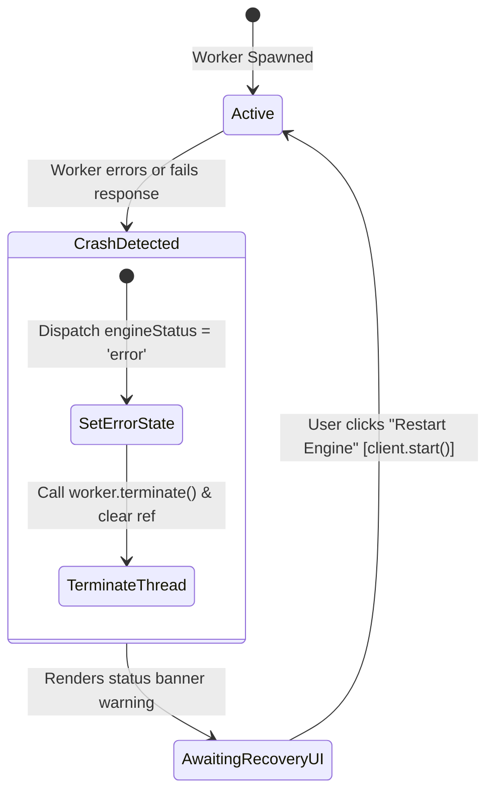

# Error Handling Specification: CheckMate Analyze (v1.0.1)

This specification defines the exception categories, recovery state transitions, resource throttling bounds, and error propagation paths in CheckMate Analyze.

---

## 1. Input Parsing & Chess Legality Exceptions

Input exceptions are split into two categories during PGN ingestion: **Syntax Parsing Errors** and **Chess Legality Violations**.

```
                           +------------------------+
                           |  Raw Pasted PGN Input  |
                           +-----------+------------+
                                       |
                                       v
                           +------------------------+
                           |  validatePgnSyntax()   |
                           +-----------+------------+
                                       |
                +----------------------+----------------------+
                | (Syntax Invalid)                            | (Syntax Valid)
                v                                             v
     +--------------------+                       +-----------------------+
     | Render warnings    |                       |  checkMoveLegality()  |
     | with line numbers  |                       +-----------+-----------+
     +--------------------+                                   |
                                       +----------------------+----------------------+
                                       | (Move Illegal)                              | (Move Legal)
                                       v                                             v
                            +--------------------+                        +---------------------+
                            | Output exact ply   |                        | parsePgn() -> state |
                            | error description  |                        +---------------------+
                            +--------------------+
```

### A. Syntax Errors (`validatePgnSyntax`)
* **Detection:** Tokenizes PGN tags and move logs.
* **Failure Payload:** Returns `Array<{ line: number, message: string }>`.
* **UI Propagation:** Resets the board, keeps the user in `LandingForm`, and displays a red bulleted list indicating malformed syntax line-by-line.

### B. Legality Violations (`checkMoveLegality`)
* **Detection:** Uses `chess.js` to play through the parsed moves chronologically. If a move cannot be validated legally, execution terminates.
* **Failure Payload:** Returns `{ message: string, move: string, ply: number }`.
* **UI Propagation:** Renders a distinct warning block: "Illegal Move Encountered: Ply 14 (Black e5) is invalid in this position." Halt parsing to prevent game corruption.

---

## 2. Web Worker Crash Detection & Recovery

Because Stockfish runs inside a client-side WASM sandboxed thread, a crash (e.g. browser out-of-memory or worker termination) must be caught and recovered from without forcing a hard browser refresh.

### Worker Recovery State Machine



### Fault Tolerance Implementations:
1. **Thread Disposal:** The `StockfishClient.stop()` method runs a safety wrapper:
   ```typescript
   public stop(): void {
     if (this.worker) {
       this.sendCommand('stop');
       this.worker.terminate(); // Safely kill background thread
       this.worker = null;      // Prevent memory leaks
     }
   }
   ```
2. **Auto-Recovery Trigger:** Upon clicking the restart option on the Status Bar, the orchestration layer dispatches `UPDATE_ENGINE_STATUS` with state `initializing` and instantiates a new `StockfishClient`. This ensures a fresh WebAssembly runtime environment is loaded.

---

## 3. Resource Exhaustion & Rendering Throttling

To prevent CPU starvation and UI layout stutters, several throttling limits are enforced:

### A. Graph Render Debounce
During active calculations, the engine streams evaluations continuously. For games with over 150 plies, updating the Recharts AreaChart on every evaluation update drops the rendering thread below 25fps due to high SVG calculations.
* **Constraint:** Evaluation graph points are plotted only when the engine completes analysis (reports `bestmove`) or reaches search depth 10. Intermediate calculations are buffered in memory and not rendered immediately.

### B. Worker Interrupt Piling
Rapid move traversing creates a queue of worker tasks. If the client doesn't clear old tasks, CPU usage spikes, leading to browser thermal throttling.
* **Constraint:** The first instruction in `analyzePosition` sends an immediate UCI `stop` command, clearing the worker thread's internal calculation registers before setting the new position FEN.

---

## 4. UI Error Propagation Pathways

Error states propagate through the workbench using a standardized flow:

1. **Source Exception:** Handled inside utility classes (`pgnParser.ts`, `stockfishClient.ts`) via `try/catch` scopes.
2. **Action Dispatch:** Caught errors are translated into user-friendly strings and dispatched as actions (e.g. `type: 'UPDATE_ENGINE_STATUS', payload: { status: 'error' }`).
3. **Context Broadcast:** State reducer updates the read-only `WorkbenchState`.
4. **Component Boundary Render:** Components subscribe to state. `StatusBar` reads `engineStatus === 'error'` and renders the error banner. The main board remains interactive, allowing the user to navigate the game even when the analysis engine is offline.

---

**End of Error Handling Specification**
