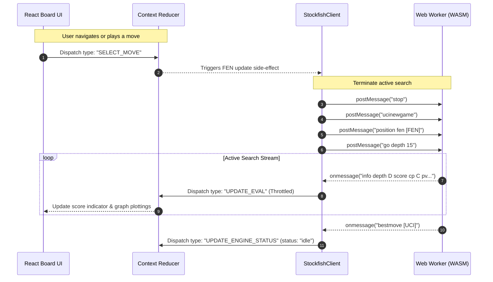

# Learning & Engineering Handbook: CheckMate Analyze (v1.0.1)

This handbook serves as a production-grade knowledge base for developers working on CheckMate Analyze. It documents thread-isolation data flows, architectural trade-offs, debugging guidelines, and critical engineering takeaways learned during system implementation.

---

## 1. System Threading & Data Flow Diagrams

To keep board navigation and animations at a smooth 60fps, CheckMate Analyze divides work between the browser's Main UI thread and a background Stockfish Web Worker thread.

### A. ASCII Thread Boundaries

```text
+-----------------------------------------------------------------------------+
|                               BROWSER RUNTIME                               |
|                                                                             |
|  +-------------------------------------+                                    |
|  |           MAIN UI THREAD            |                                    |
|  |                                     |                                    |
|  |  +-------------------------------+  |                                    |
|  |  |           React UI            |  |                                    |
|  |  |  (Board, Move List, Graph)    |  |                                    |
|  |  +---------------+---------------+  |                                    |
|  |                  | (Select move)    |                                    |
|  |                  v                  |                                    |
|  |  +---------------+---------------+  |                                    |
|  |  |     Workbench Context Store   |  |                                    |
|  |  |       (State Reducer)         |  |                                    |
|  |  +---------------+---------------+  |                                    |
|  |                  | (FEN payload)    |                                    |
|  |                  v                  |                                    |
|  |  +---------------+---------------+  |                                    |
|  |  |       StockfishClient         |  |                                    |
|  |  +-------------------------------+  |                                    |
|  +------------------|------------------+                                    |
|                     |                                                       |
|                     | postMessage("position fen...")                        |
|                     | postMessage("go depth 15")                            |
|                     | (Asynchronous Message Port Boundary)                  |
|                     |                                                       |
|                     | onmessage("info depth 8 score cp 24...")              |
|                     | onmessage("bestmove d2d4")                            |
|                     v                                                       |
|  +------------------|------------------+                                    |
|  |                  |                  |                                    |
|  |  +---------------+---------------+  |                                    |
|  |  |        Web Worker Port        |  |                                    |
|  |  +---------------+---------------+  |                                    |
|  |                  |                  |                                    |
|  |                  v                  |                                    |
|  |  +---------------+---------------+  |                                    |
|  |  |    Stockfish WASM Engine      |  |                                    |
|  |  |     (Deep Alpha-Beta)         |  |                                    |
|  |  +-------------------------------+  |                                    |
|  |                                     |                                    |
|  |        BACKGROUND WORKER THREAD     |                                    |
|  +-------------------------------------+                                    |
+-----------------------------------------------------------------------------+
```

### B. Mermaid Sequence Flow



---

## 2. Key Architectural Decisions & Trade-offs

During development, we evaluated several architectural designs against our core goals of local-first privacy, zero server costs, and UI responsiveness.

### A. Local-First Client-Side vs. Cloud Engine Server
* **Decision:** Execute Stockfish compiled to WASM directly in the user's browser instead of hosting a remote Stockfish server API.
* **Trade-off:**
  * *Pros:* Zero hosting fees; scales infinitely with user volume; offline capability; absolute privacy (game data never leaves the user's machine).
  * *Cons:* Engine performance is bound by the user's device CPU; drains battery faster on mobile devices.
* **Justification:** Cloud engines introduce latency and incur high server hosting costs, violating our core product principles. Spawning a local worker shifts computation costs to the client, ensuring the service remains free and private.

### B. Background Web Worker vs. Main Thread Execution
* **Decision:** Spawn Stockfish inside an isolated Web Worker instead of running it on the main JavaScript thread.
* **Trade-off:**
  * *Pros:* UI remains highly responsive at 60fps; board piece dragging and navigation are never blocked by calculations.
  * *Cons:* Spawns separate memory heaps; introduces serialization overhead when sending strings across `postMessage()`.
* **Justification:** Chess engine searches are CPU-intensive. Running calculations on the main thread would freeze the UI, violating our first non-negotiable principle: "The Board is Always Usable."

### C. Flat History Arrays vs. Recursive Node Trees (ChessNode)
* **Decision:** Model the move history as two flat arrays (`moves` and `sandboxMoves`) rather than a recursive, nested child-node tree structure (`ChessNode`).
* **Trade-off:**
  * *Pros:* Simple state mapping; $O(1)$ lookups by array index; easy serialization for PGN exports; fits cleanly within React's immutable reducer patterns.
  * *Cons:* Slicing variation branches is slightly destructive; does not support saving multiple, nested sandbox branches concurrently.
* **Justification:** An MVP requires a simple, clean, and maintainable state representation. Flat arrays keep the reducer logic straightforward, and slicing the sandbox timeline behaves like Git branching, which is intuitive for users.

---

## 3. Debugging & Troubleshooting Guide

### A. Diagnosing Background Web Worker Freezes
* **Symptoms:** The status bar stays stuck on `analyzing`, but no evaluation lines are printed, and the board evaluation bar remains unchanged.
* **Diagnostic Steps:**
  1. Open Browser DevTools (`F12`) and navigate to the **Console** and **Sources** tabs.
  2. Verify that `stockfish.js` is loaded from the root path (`/stockfish.js`). If a `404 Not Found` is returned, check the Vite static assets configuration.
  3. Inspect the worker threads: In Chrome, go to **Application** $\rightarrow$ **Background Services** $\rightarrow$ **Web Workers** to verify the thread is running.
  4. Inject debug statements in `stockfishClient.ts` to log all outgoing UCI commands and incoming messages:
     ```typescript
     this.worker.onmessage = (event) => {
       console.log("[Worker Output]:", event.data);
     };
     ```
  5. If `ucinewgame` is sent but no `readyok` is returned, the WASM compilation may have failed due to browser memory limits. Call `worker.terminate()` and reload.

### B. Troubleshooting Memory Leaks During High-Move Games
* **Symptoms:** The browser tab's RAM usage increases over time during deep analysis runs, eventually leading to a tab crash.
* **Diagnostic Steps:**
  1. Open Chrome DevTools and select the **Memory** panel. Take a heap snapshot.
  2. Perform rapid board navigation for 20 seconds, then take a second heap snapshot.
  3. Compare the snapshots using the **Comparison** view. Look for accumulated instances of `Worker` or `EventListener`.
  4. **Common Cause:** React context rebuilds can spawn duplicate worker listeners if cleanup functions are missing in `useEffect`:
     ```typescript
     // Ensure the listener cleanup is returned and called:
     const cleanupEval = client.addEvalListener((evaluation) => { ... });
     return () => {
       client.stop(); // Terminate worker
       cleanupEval(); // Remove listener reference
     };
     ```
  5. Verify that `client.stop()` successfully calls `worker.terminate()` to release the worker thread's allocated memory back to the OS.

### C. Debugging PGN Ingestion Edge Cases
* **Symptoms:** Ingesting a PGN fails silently or halts at a specific move ply with an error.
* **Diagnostic Steps:**
  1. Copy the raw PGN text and paste it into an online PGN validator to confirm it complies with the 1994 Standard.
  2. Check the console log to see where parsing halted:
     ```javascript
     console.error("PGN Legality Error:", error.message);
     ```
  3. **Common Cause 1 (Syntax):** Malformed tags (e.g. `[White"Player"]` missing a space) will fail `validatePgnSyntax`. Ensure tags use the standard format: `[TagName "Value"]`.
  4. **Common Cause 2 (Legality):** The PGN contains illegal moves (e.g. castling through check or moving a pinned piece). If `chess.js` rejects a move, verify if the starting position requires a custom FEN header tag: `[FEN "rnbqkbnr/..."]`.

---

## 4. Key Engineering Takeaways

1. **Web Worker Serialization Costs are Low:** We observed that serializing UCI commands as strings across the message port boundary takes $< 1\text{ ms}$. This confirms that string parsing does not introduce noticeable latency compared to the engine's search times.
2. **Debouncing UI Updates is Essential:** Streaming evaluations directly to the React state at 50fps causes layout reflow bottlenecks. Throttling UI updates to $100\text{ ms} - 150\text{ ms}$ windows keeps rendering at 60fps without losing real-time responsiveness.
3. **Always Clear Engine Queues:** In a local-first application, the user controls the calculation load. If the user navigates backward and forward rapidly, the engine must receive immediate `stop` commands to abort stale calculations. Failing to do so causes calculation queues to pile up, causing the client CPU to run at 100% capacity and trigger thermal throttling.
4. **Isolate Calculations from State Reducer:** The engine controller must use references (`useRef`) to track the current active FEN and sandbox state. If the state reducer triggers full component re-renders on every intermediate depth update, it can cause loop feedback stutters. Referencing values via refs avoids duplicate worker creation calls during state transitions.

---

**End of Learning & Engineering Handbook**
