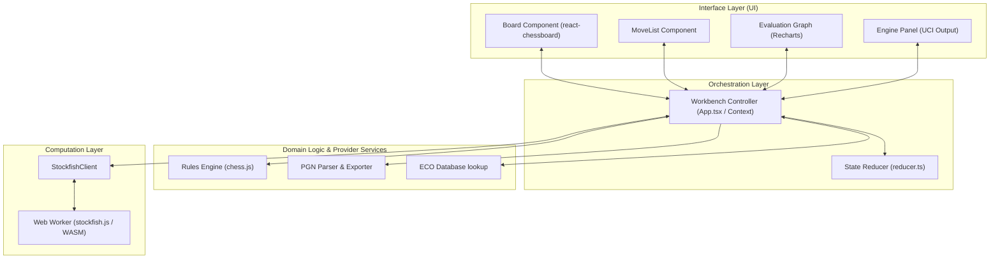

# System Architecture & Technical Specifications: CheckMate Analyze (v1.0.1)

This document provides a detailed technical specification of the system architecture of CheckMate Analyze. It defines component boundaries, thread isolation, stateless in-memory models, and fault-tolerance error flows.

---

## 1. Architectural Overview & Component Boundaries

CheckMate Analyze is structured as a **Local-First, Client-Side Application**. The system is organized into four distinct logical layers to maintain separation of concerns and ensure low component coupling.



### Layer Responsibilities:
1. **Interface Layer (UI):** Consumes the state context and renders visual components. It is completely stateless with respect to game rules or engine calculations, operating purely on callbacks and state properties.
2. **Orchestration Layer:** Manages application state. It intercepts UI interactions, checks move rules, dispatches messages to the computation layer, and commits updates to the store.
3. **Domain & Provider Layer:** Encapsulates the rules of chess and parsing standards. It has zero external dependencies and zero knowledge of the UI or engine states.
4. **Computation Layer:** Manages Stockfish WASM. It operates asynchronously in a isolated context, exchanging string messages via the UCI protocol.

---

## 2. Thread Isolation & UCI Message Protocol

To maintain a fluid interface (NFR-503), the CPU-intensive chess engine is isolated from the browser's main execution thread.

```
+------------------------------------------+          +-------------------------------------------+
|               MAIN THREAD                |          |             WEB WORKER THREAD             |
|                                          |          |                                           |
|  [ React App ]                           |          |  [ stockfish.js ]                         |
|        |                                 |          |        |                                  |
|        v                                 |          |        |                                  |
|  [ StockfishClient ]                     |          |        v                                  |
|   - sendCommand()                        |          |  [ Compiled WASM Engine ]                 |
|   - handleMessage()                      |          |  - Deep alpha-beta search                 |
|        |                                 |          |  - Evaluation scoring                     |
|        |                                 |          |        |                                  |
+--------|---------------------------------+          +--------|----------------------------------+
         |                                                     |
         | postMessage("position fen...")                      |
         |---------------------------------------------------->|
         |                                                     |
         | postMessage("go depth 15")                          |
         |---------------------------------------------------->|
         |                                                     |
         | onmessage("info depth 8 score cp 12 pv...")         |
         |<----------------------------------------------------|
         |                                                     |
         | onmessage("bestmove e2e4")                          |
         |<----------------------------------------------------|
```

### Thread Communication Protocol Rules:
* **Asynchronous Message Passing:** The main thread interacts with the worker strictly using `postMessage()` and the `onmessage` callback. Synchronous blocking operations are physically impossible across this boundary.
* **UCI Standard Command Sequence:**
  1. `uci`: Initializes Universal Chess Interface options.
  2. `setoption name MultiPV value 3`: Requests three principal variations.
  3. `isready`: Verifies the worker is ready.
  4. `ucinewgame`: Prepares the engine for a fresh analysis.
  5. `position fen [FEN]`: Passes the Forsyth-Edwards Notation (FEN) of the position to analyze.
  6. `go depth 15`: Launches the search with a depth limit of 15.
  7. `stop`: Interrupts any active engine calculations instantly.

---

## 3. Stateless In-Memory Lifecycle

The workbench operates on an **ephemeral, in-memory state model** (defined in `types/state.ts` and managed in `context/reducer.ts`).

```
+---------------------------------------------------------------------------------+
|                                 WORKBENCH STATE                                 |
+---------------------------------------------------------------------------------+
|  headers: GameHeader | null (Event, Site, Date, White, Black, Result)           |
|  moves: MoveEntry[] (ply, san, uci, fen, evaluation, classification)            |
|  activeMoveIndex: number                                                        |
|                                                                                 |
|  engineDepth: number                                                            |
|  engineNps: number                                                              |
|  engineStatus: 'idle' | 'initializing' | 'analyzing' | 'error'                  |
|                                                                                 |
|  isSandbox: boolean                                                             |
|  sandboxMoves: MoveEntry[]                                                      |
|  sandboxActiveIndex: number                                                     |
+---------------------------------------------------------------------------------+
```

### State Lifecycle Rules:
1. **Instantiation:** Upon initial load, the state is populated with defaults. The app enters the `Awaiting Input` state.
2. **Immutability:** Reducer actions never modify the state directly. They return new state objects. Arrays (like `moves`) are duplicated before edits are applied, ensuring stable React rendering.
3. **Sandbox Clones:** Transitioning to Sandbox copies the current game timeline. Once in the Sandbox, state changes target the `sandboxMoves` array.
4. **Session Erasure:** State is stored purely in client-side RAM. If the browser tab is reloaded, closed, or reset, all analysis evaluations, classifications, and sandbox variations are permanently cleared. This preserves privacy and ensures zero data residue.

---

## 4. Fault Tolerance & Performance Optimizations

To ensure the application remains stable and performs well on low-end client hardware, several safety and recovery mechanisms are implemented.

### A. Web Worker Auto-Recovery
If Stockfish crashes or locks up, the application handles recovery gracefully without requiring a page reload:
1. **Crash Detection:** If the worker throws an error or fails to respond to an `isready` request, the client shifts the state (`engineStatus`) to `error`.
2. **Termination:** The orchestrator invokes `worker.terminate()`, instantly killing the unresponsive background thread.
3. **Re-initialization:** The UI displays a warning banner with a retry option. Clicking it calls `start()`, which spins up a fresh `new Worker('/stockfish.js')` instance, resets the state, and resumes position analysis.

### B. Rendering Performance & DOM Optimization
* **Evaluation Bar Throttling:** Stockfish streams evaluation updates rapidly (dozens of times per second). The UI throttles updates to the evaluation bar to once every $100\text{ ms}$ to prevent layout recalculation bottlenecks.
* **Graph Plot Throttling:** Recharts redraws are debounced. While the engine is streaming intermediate depth scores, the graph is not redrawn until a final evaluation or depth threshold is reached.
* **Component Memoization:** React components (such as board cells and move items) are memoized, ensuring that only the changed move plies or active selections trigger a re-render.

---

**End of System Architecture & Technical Specifications**
