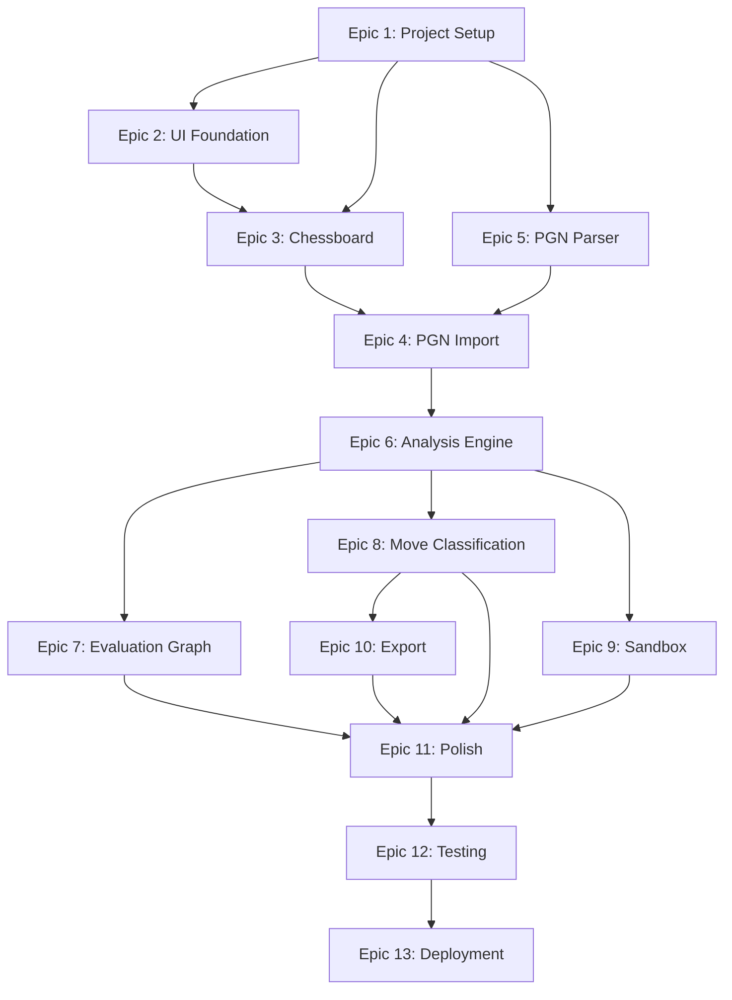

# CheckMate Analyze - Implementation Roadmap

This document outlines the end-to-end implementation roadmap for **CheckMate Analyze**, a local-first client-side chess analysis workbench. The project is broken down into 13 Sequential Epics. Each Epic is composed of User Stories, which are further divided into atomic development tasks (10 to 60 minutes each) to be completed by a single developer.

---

## Roadmap Overview

---

## Epic 1 – Project Setup

This Epic focuses on initializing the workspace, configuring development tools, and establishing the testing runtime environment.

### User Story: Developer Environment Initialization

- [ ] **TS-1.1: Initialize React + TypeScript project with Vite**
  - **Task ID:** TS-1.1
  - **Name:** Initialize Vite React TypeScript project
  - **Description:** Run Vite initializer with the React-TS template in the workspace root directory.
  - **Dependencies:** None
  - **Acceptance Criteria:** `package.json` contains React, TypeScript, and Vite dependencies. Running `npm run dev` successfully spins up local Vite dev server.
  - **Estimated Difficulty:** Easy
  - **Estimated Time:** 15 mins

- [ ] **TS-1.2: Configure Tailwind CSS**
  - **Task ID:** TS-1.2
  - **Name:** Configure Tailwind CSS
  - **Description:** Install Tailwind CSS, PostCSS, Autoprefixer, generate configuration files, and add tailwind directives to global style sheets.
  - **Dependencies:** TS-1.1
  - **Acceptance Criteria:** Tailwind classes (e.g. `bg-red-500`, `flex`) render correctly in browser view during test.
  - **Estimated Difficulty:** Easy
  - **Estimated Time:** 15 mins

- [ ] **TS-1.3: Configure ESLint and Prettier**
  - **Task ID:** TS-1.3
  - **Name:** Configure ESLint and Prettier
  - **Description:** Install configuration files and plugins for ESLint and Prettier to ensure consistent code formatting and quality checks.
  - **Dependencies:** TS-1.1
  - **Acceptance Criteria:** `npm run lint` executes without critical configuration failures and catches simple syntax problems. File formatting applies on save.
  - **Estimated Difficulty:** Easy
  - **Estimated Time:** 20 mins

- [ ] **TS-1.4: Install and Initialize shadcn/ui**
  - **Task ID:** TS-1.4
  - **Name:** Install and Initialize shadcn/ui
  - **Description:** Set up shadcn/ui dependencies (`tailwind-merge`, `clsx`, `lucide-react`) and run the shadcn init CLI tool to establish target paths.
  - **Dependencies:** TS-1.2, TS-1.3
  - **Acceptance Criteria:** `components.json` is created at project root. A generated shadcn button component compiles and renders without errors.
  - **Estimated Difficulty:** Easy
  - **Estimated Time:** 25 mins

- [ ] **TS-1.5: Establish Project Folder Structure**
  - **Task ID:** TS-1.5
  - **Name:** Setup Folder Structure
  - **Description:** Create directories for `features/`, `components/`, `hooks/`, `context/`, `services/`, `utils/`, `workers/`, and `types/` as specified in the Tech Stack architecture.
  - **Dependencies:** TS-1.1
  - **Acceptance Criteria:** All directory structures exist in `/src` with corresponding `.gitkeep` files or index exports.
  - **Estimated Difficulty:** Easy
  - **Estimated Time:** 15 mins

- [ ] **TS-1.6: Setup Vitest and React Testing Library**
  - **Task ID:** TS-1.6
  - **Name:** Setup Testing Environment
  - **Description:** Install Vitest, `@testing-library/react`, `@testing-library/jest-dom`, and `@vitejs/plugin-react` devDependencies. Write test script in `package.json`.
  - **Dependencies:** TS-1.1
  - **Acceptance Criteria:** `npm run test` executes, detects test files, and runs a mock assertion successfully.
  - **Estimated Difficulty:** Medium
  - **Estimated Time:** 30 mins

---

## Epic 2 – UI Foundation

This Epic lays down the base application layout structure, global color themes, global state containers, and notification systems.

### User Story: Core Interface Layout & Global State

- [ ] **TS-2.1: Setup Global Theme CSS Variables**
  - **Task ID:** TS-2.1
  - **Name:** Define Global CSS Variables
  - **Description:** Define colors, typography, glassmorphism shadows, and font imports (Inter/Outfit) inside `src/index.css`.
  - **Dependencies:** TS-1.2
  - **Acceptance Criteria:** Global styles apply to body element; custom variables (e.g. `--primary`, `--background`) render correctly.
  - **Estimated Difficulty:** Easy
  - **Estimated Time:** 20 mins

- [ ] **TS-2.2: Create Dashboard Layout Grid**
  - **Task ID:** TS-2.2
  - **Name:** Implement Main Shell Grid
  - **Description:** Write the responsive outer layout component hosting sections for Chessboard (Left), Sidebar (Right), and Graph (Bottom).
  - **Dependencies:** TS-1.5, TS-2.1
  - **Acceptance Criteria:** Visual skeleton renders in browser: Board container on left, sidebar panel on right, graph footprint on bottom.
  - **Estimated Difficulty:** Easy
  - **Estimated Time:** 30 mins

- [ ] **TS-2.3: Initialize Workbench State Context & Reducer**
  - **Task ID:** TS-2.3
  - **Name:** Create React State Provider
  - **Description:** Create the core `WorkbenchContext` and a state reducer managing active game records, current move navigation pointer, analysis states, and sandbox mode.
  - **Dependencies:** TS-1.5
  - **Acceptance Criteria:** Main App component is wrapped in the provider. Children can successfully read states and dispatch test actions.
  - **Estimated Difficulty:** Medium
  - **Estimated Time:** 45 mins

- [ ] **TS-2.4: Implement Global Error Notification Component**
  - **Task ID:** TS-2.4
  - **Name:** Build Global Alert Toast
  - **Description:** Create an alert notification UI component using shadcn alert/toast libraries to render error events.
  - **Dependencies:** TS-1.4, TS-2.3
  - **Acceptance Criteria:** Dispatching a validation error action immediately triggers a slide-in banner/toast at the top right of the viewport.
  - **Estimated Difficulty:** Easy
  - **Estimated Time:** 30 mins

---

## Epic 3 – Chessboard

This Epic integrates the interactive chessboard UI widget and handles board navigation controls.

### User Story: Interactive Position Navigation

- [ ] **TS-3.1: Install Chess Engine and Board Dependencies**
  - **Task ID:** TS-3.1
  - **Name:** Install Chess packages
  - **Description:** Run `npm i chess.js react-chessboard` to obtain rule-validation and board UI capabilities.
  - **Dependencies:** TS-1.1
  - **Acceptance Criteria:** Libraries appear in `package.json` dependencies and compile in files.
  - **Estimated Difficulty:** Easy
  - **Estimated Time:** 10 mins

- [ ] **TS-3.2: Create Chessboard Component**
  - **Task ID:** TS-3.2
  - **Name:** Build Board Component Wrapper
  - **Description:** Create a custom React wrapper around `react-chessboard`. Bind the component's FEN property to the active position from global state.
  - **Dependencies:** TS-2.2, TS-2.3, TS-3.1
  - **Acceptance Criteria:** Chessboard displays starting positions in the central panel of the main grid.
  - **Estimated Difficulty:** Easy
  - **Estimated Time:** 30 mins

- [ ] **TS-3.3: Implement Move Navigation Reducer Actions**
  - **Task ID:** TS-3.3
  - **Name:** Create Move Nav Actions
  - **Description:** Implement reducer actions to increment or decrement the active move index (Next, Prev, First, Last).
  - **Dependencies:** TS-2.3
  - **Acceptance Criteria:** Dispatched events update active move pointer in the state and reflect correct piece positions on board.
  - **Estimated Difficulty:** Easy
  - **Estimated Time:** 30 mins

- [ ] **TS-3.4: Integrate Keyboard Navigation Shortcuts**
  - **Task ID:** TS-3.4
  - **Name:** Implement Key Bindings
  - **Description:** Set up event listeners for `ArrowLeft`, `ArrowRight`, `Home`, and `End` keys mapping to the move navigation actions.
  - **Dependencies:** TS-3.2, TS-3.3
  - **Acceptance Criteria:** Pressing left/right arrow keys navigates through loaded game steps.
  - **Estimated Difficulty:** Easy
  - **Estimated Time:** 25 mins

---

## Epic 4 – PGN Import

This Epic implements input controls for entering PGN data into the system, including text pastes and local file uploads.

### User Stories: US-01, US-02 (Awaiting Input State UI)

- [ ] **TS-4.1: Build Landing / Awaiting Input View**
  - **Task ID:** TS-4.1
  - **Name:** Build Landing Layout
  - **Description:** Create the initial state screen displaying input interfaces while no game is active.
  - **Dependencies:** TS-2.2, TS-2.3
  - **Acceptance Criteria:** When `state.gameLoaded` is false, hide the main workbench panels and show the landing interface.
  - **Estimated Difficulty:** Easy
  - **Estimated Time:** 35 mins

- [ ] **TS-4.2: Build PGN Text Paste Handler**
  - **Task ID:** TS-4.2
  - **Name:** Build PGN Paste UI
  - **Description:** Implement the UI text area box, input buttons, and submission hooks dispatching the string to the validation loop.
  - **Dependencies:** TS-4.1
  - **Acceptance Criteria:** Input accepts typed/pasted text and fires validation event when "Load Game" is clicked.
  - **Estimated Difficulty:** Easy
  - **Estimated Time:** 20 mins

- [ ] **TS-4.3: Implement PGN File Upload Reader**
  - **Task ID:** TS-4.3
  - **Name:** Build File Uploader
  - **Description:** Implement file drag-and-drop selector reading `.pgn` files via HTML5 `FileReader` and piping raw text to validation.
  - **Dependencies:** TS-4.1
  - **Acceptance Criteria:** Dragging/selecting a local `.pgn` file extracts content as a text string and triggers parse functions.
  - **Estimated Difficulty:** Easy
  - **Estimated Time:** 25 mins

- [ ] **TS-4.4: Integrate Loading & Spinner States**
  - **Task ID:** TS-4.4
  - **Name:** Build Ingestion Transitions
  - **Description:** Implement transitions between "Awaiting Input", "Validating", and "Game Loaded". Show spinner overlay while parsing takes place.
  - **Dependencies:** TS-2.4, TS-4.1
  - **Acceptance Criteria:** Selecting a file displays a spinner. Processing errors display notifications and restore original landing state.
  - **Estimated Difficulty:** Easy
  - **Estimated Time:** 20 mins

---

## Epic 5 – PGN Parser

This Epic parses the PGN strings, runs chess rules validation, extract headers, and maps moves to UI lists.

### User Stories: US-01, US-02, US-03 (Metadata & Rule Validation)

- [ ] **TS-5.1: Create PGN Parser Utility**
  - **Task ID:** TS-5.1
  - **Name:** Create PGN Parser Module
  - **Description:** Implement a parsing function using `chess.js` to process PGN strings, parse tags (Event, White, Black, Date, Result), and output an array of Move Entities.
  - **Dependencies:** TS-3.1, TS-2.3
  - **Acceptance Criteria:** Function converts standard PGN into an structured Game object containing full metadata and structured move lists.
  - **Estimated Difficulty:** Medium
  - **Estimated Time:** 50 mins

- [ ] **TS-5.2: Implement Illegal Move Validation Check**
  - **Task ID:** TS-5.2
  - **Name:** Build Legality Checker
  - **Description:** Iterate sequentially over parsed moves using a local `Chess` instance to identify rule violations. Throw specific errors on failure.
  - **Dependencies:** TS-5.1
  - **Acceptance Criteria:** Passing a PGN with an illegal move throws a clear exception: "Move 12: White played illegal move..." to be displayed by the error alert component.
  - **Estimated Difficulty:** Medium
  - **Estimated Time:** 45 mins

- [ ] **TS-5.3: Build ECO Opening Lookup Service**
  - **Task ID:** TS-5.3
  - **Name:** Build Opening Lookup Engine
  - **Description:** Load a lightweight ECO database (JSON representation of first 8-10 plies of key openings) in `services/`. Perform lookups based on move sequences.
  - **Dependencies:** TS-2.3, TS-5.1
  - **Acceptance Criteria:** Navigation state updates display corresponding opening names and ECO codes (e.g. "C00 French Defense") in UI info banner.
  - **Estimated Difficulty:** Medium
  - **Estimated Time:** 50 mins

- [ ] **TS-5.4: Create Sidebar Move List Component**
  - **Task ID:** TS-5.4
  - **Name:** Build Move List Component
  - **Description:** Build a scrollable component displaying moves in dual columns (White / Black) with step indices. Highlight active selected move.
  - **Dependencies:** TS-2.2, TS-3.3, TS-5.1
  - **Acceptance Criteria:** Component lists all game moves sequentially. Clicking any item dispatches updates to change board FEN position.
  - **Estimated Difficulty:** Medium
  - **Estimated Time:** 40 mins

---

## Epic 6 – Analysis Engine

This Epic initializes Stockfish client-side inside a separate Web Worker thread and coordinates UCI message-passing events.

### User Stories: US-04, US-07 (Stockfish WASM Integration)

- [ ] **TS-6.1: Setup Stockfish WASM Binaries**
  - **Task ID:** TS-6.1
  - **Name:** Serve Engine Binaries
  - **Description:** Obtain Stockfish WASM binary and wrapper script (`stockfish.js`, `stockfish.wasm`) and place them in the `/public` assets folder.
  - **Dependencies:** TS-1.1
  - **Acceptance Criteria:** WASM resources load successfully from browser URL `/stockfish.js`.
  - **Estimated Difficulty:** Medium
  - **Estimated Time:** 35 mins

- [ ] **TS-6.2: Create Stockfish Web Worker Interface**
  - **Task ID:** TS-6.2
  - **Name:** Setup Engine Worker Thread
  - **Description:** Write standard Web Worker loader script (`src/workers/stockfish.worker.ts`) to isolate engine computation on another thread.
  - **Dependencies:** TS-6.1
  - **Acceptance Criteria:** Web worker registers successfully in browser without throwing cross-origin or thread-blocking errors.
  - **Estimated Difficulty:** Hard
  - **Estimated Time:** 60 mins

- [ ] **TS-6.3: Implement UCI Message Parser**
  - **Task ID:** TS-6.3
  - **Name:** Parse UCI Engine Outputs
  - **Description:** Develop utility functions to convert engine responses (`info depth X score cp Y ... pv ...` or `score mate Y`) into structured Evaluation entities.
  - **Dependencies:** TS-6.2
  - **Acceptance Criteria:** UCI output string is correctly mapped to an object containing Centipawns, Mate in N, depth, and best line moves.
  - **Estimated Difficulty:** Hard
  - **Estimated Time:** 60 mins

- [ ] **TS-6.4: Develop Analysis Orchestrator Service**
  - **Task ID:** TS-6.4
  - **Name:** Implement Engine Coordinator
  - **Description:** Write `services/AnalysisOrchestrator.ts` to manage worker requests: configure Multi-PV settings (up to 3 candidate lines), request evaluations for target FENs, and cancel pending tasks.
  - **Dependencies:** TS-6.3
  - **Acceptance Criteria:** Class successfully commands Web Worker via postMessage, stops running evaluations, and updates state without main-thread lag.
  - **Estimated Difficulty:** Hard
  - **Estimated Time:** 50 mins

- [ ] **TS-6.5: Link Engine Outputs to Workbench State**
  - **Task ID:** TS-6.5
  - **Name:** Pipe Engine Eval to Context
  - **Description:** Wire the orchestration listener into the global state provider, updating move items progressively as evaluations stream.
  - **Dependencies:** TS-2.3, TS-6.4
  - **Acceptance Criteria:** Navigating to a move starts analysis; progress is written directly to the state's Move Entity.
  - **Estimated Difficulty:** Medium
  - **Estimated Time:** 45 mins

- [ ] **TS-6.6: Create Multi-PV UI Panel**
  - **Task ID:** TS-6.6
  - **Name:** Build Best Lines Component
  - **Description:** Create a component rendering the top 3 recommended move lines generated by the engine, detailing evaluation scores and SAN notation paths.
  - **Dependencies:** TS-2.2, TS-6.5
  - **Acceptance Criteria:** Panel updates in real-time, displaying alternative variations for the active selected position.
  - **Estimated Difficulty:** Medium
  - **Estimated Time:** 40 mins

---

## Epic 7 – Evaluation Graph

This Epic introduces the interactive real-time visual line graph plotting game advantage changes move-by-move.

### User Stories: US-05 (Progressive Visualizations)

- [ ] **TS-7.1: Configure Recharts Library**
  - **Task ID:** TS-7.1
  - **Name:** Integrate Recharts package
  - **Description:** Install Recharts library dependency and verify module imports compile.
  - **Dependencies:** TS-1.1
  - **Acceptance Criteria:** Recharts configuration works within build environments.
  - **Estimated Difficulty:** Easy
  - **Estimated Time:** 15 mins

- [ ] **TS-7.2: Create Evaluation Graph Component**
  - **Task ID:** TS-7.2
  - **Name:** Build Line Chart
  - **Description:** Implement `EvaluationGraph.tsx` plotting evaluations on Y-axis (capped at -10 to +10 range) and ply number on X-axis.
  - **Dependencies:** TS-2.2, TS-7.1, TS-2.3
  - **Acceptance Criteria:** Line chart displays at the bottom viewport showing a progressive plot of centipawn advantages.
  - **Estimated Difficulty:** Medium
  - **Estimated Time:** 50 mins

- [ ] **TS-7.3: Implement Graph Updates & Throttle Controls**
  - **Task ID:** TS-7.3
  - **Name:** Setup Graph Refresh Throttler
  - **Description:** Write a throttling utility in the graph update stream (e.g. maximum frame refresh rate of 250ms) to ensure smooth 60fps scrolling.
  - **Dependencies:** TS-7.2, TS-6.5
  - **Acceptance Criteria:** Graph updates progressively as evaluations come in without causing canvas redraw delays or UI freezes.
  - **Estimated Difficulty:** Medium
  - **Estimated Time:** 40 mins

- [ ] **TS-7.4: Implement Graph Click Navigation**
  - **Task ID:** TS-7.4
  - **Name:** Bind Graph Node Clicks
  - **Description:** Listen to node click events on the chart, resolving the target ply and dispatching move-select actions.
  - **Dependencies:** TS-7.2, TS-3.3
  - **Acceptance Criteria:** Clicking any point on the evaluation graph chart instantly synchronizes the Board and Move List to that position.
  - **Estimated Difficulty:** Easy
  - **Estimated Time:** 30 mins

---

## Epic 8 – Move Classification

This Epic determines move accuracy based on centipawn loss and highlights results with badges.

### User Stories: US-04 (Evaluations and Classifications)

- [ ] **TS-8.1: Implement Centipawn Loss Calculator**
  - **Task ID:** TS-8.1
  - **Name:** Build CP Loss Calculator
  - **Description:** Write utility calculating difference between the played move evaluation and best alternative move evaluation, taking the current side to move into account.
  - **Dependencies:** TS-6.5
  - **Acceptance Criteria:** Given played move (+0.20) and engine line (+1.50) for White, utility returns a loss of 130 centipawns.
  - **Estimated Difficulty:** Easy
  - **Estimated Time:** 30 mins

- [ ] **TS-8.2: Implement Classification Heuristics**
  - **Task ID:** TS-8.2
  - **Name:** Build Classification Rules
  - **Description:** Write functions to categorize loss: Best (0 loss), Excellent (<20 loss), Good (<50 loss), Inaccuracy (50-100 loss), Mistake (100-200 loss), Blunder (>=200 loss).
  - **Dependencies:** TS-8.1
  - **Acceptance Criteria:** Utility inputs evaluation deltas and returns correct accuracy categories.
  - **Estimated Difficulty:** Easy
  - **Estimated Time:** 30 mins

- [ ] **TS-8.3: Add Classification Badges to Move List UI**
  - **Task ID:** TS-8.3
  - **Name:** Render Move Badges
  - **Description:** Place visual status icons beside moves in the sidebar Move List (red blunder flag, orange mistake, etc.).
  - **Dependencies:** TS-5.4, TS-8.2
  - **Acceptance Criteria:** Moves display color-coded badges matching their computed classification.
  - **Estimated Difficulty:** Easy
  - **Estimated Time:** 35 mins

- [ ] **TS-8.4: Add Interactive Classification Explanations**
  - **Task ID:** TS-8.4
  - **Name:** Build Classification Tooltips
  - **Description:** Implement hover tooltips over move badges displaying exact centipawn loss figures and what the best move would have been.
  - **Dependencies:** TS-8.3
  - **Acceptance Criteria:** Hovering over a badge displays a clean popup explaining the classification.
  - **Estimated Difficulty:** Easy
  - **Estimated Time:** 25 mins

---

## Epic 9 – Sandbox

This Epic creates the sandboxed "What-If" mode allowing users to test lines interactively without corrupting the loaded PGN.

### User Stories: US-06 (Sandbox Branching)

- [ ] **TS-9.1: Implement Sandbox Branch State**
  - **Task ID:** TS-9.1
  - **Name:** Create Sandbox State Reducers
  - **Description:** Add state properties tracking active sandbox session status, temporary board positions, and sandbox branch moves.
  - **Dependencies:** TS-2.3
  - **Acceptance Criteria:** Playing a move that deviates from the original game branch successfully forks the board into a transient state.
  - **Estimated Difficulty:** Medium
  - **Estimated Time:** 45 mins

- [ ] **TS-9.2: Connect Board Move Triggers to Sandbox**
  - **Task ID:** TS-9.2
  - **Name:** Build Piece Drop Branch Listener
  - **Description:** Write logic inside board handlers checking if played move matches PGN. If it deviates, initiate the sandbox state branch.
  - **Dependencies:** TS-3.2, TS-9.1
  - **Acceptance Criteria:** Moving a piece to a deviation square preserves original PGN immutable and transitions board to sandbox mode.
  - **Estimated Difficulty:** Medium
  - **Estimated Time:** 40 mins

- [ ] **TS-9.3: Build Sandbox UI Overlay and Return Controls**
  - **Task ID:** TS-9.3
  - **Name:** Build Sandbox Interface
  - **Description:** Design a visual overlay banner showing "Sandbox Mode Active" alongside a prominent "Return to Game" exit button.
  - **Dependencies:** TS-2.2, TS-9.1
  - **Acceptance Criteria:** Overlay banner renders during sandbox sessions. Clicking the button restores original game status and layout.
  - **Estimated Difficulty:** Easy
  - **Estimated Time:** 25 mins

- [ ] **TS-9.4: Integrate Sandbox Engine Analysis Hook**
  - **Task ID:** TS-9.4
  - **Name:** Bind Sandbox Moves to Stockfish
  - **Description:** Hook board updates in sandbox mode to request single-move engine evaluations for played variations.
  - **Dependencies:** TS-6.4, TS-9.2
  - **Acceptance Criteria:** Playing moves inside the sandbox triggers immediate Stockfish evaluations, displaying scores for the explored path.
  - **Estimated Difficulty:** Medium
  - **Estimated Time:** 35 mins

---

## Epic 10 – Export

This Epic handles saving the analysis session by exporting the game as an annotated PGN file.

### User Stories: US-08 (Annotated Export)

- [ ] **TS-10.1: Build PGN Annotation Serializer**
  - **Task ID:** TS-10.1
  - **Name:** Write PGN Serializer
  - **Description:** Implement utility parsing the moves and evaluations to output standard PGN with injected comment strings (e.g. `{ [%eval 0.45] [%depth 12] }`).
  - **Dependencies:** TS-5.1, TS-8.2
  - **Acceptance Criteria:** Function compiles game objects back into a standard PGN string containing annotations.
  - **Estimated Difficulty:** Medium
  - **Estimated Time:** 45 mins

- [ ] **TS-10.2: Implement Client-Side File Downloader**
  - **Task ID:** TS-10.2
  - **Name:** Create File Download Trigger
  - **Description:** Write a download utility using Blobs (`URL.createObjectURL`) to trigger browser file saves.
  - **Dependencies:** TS-10.1
  - **Acceptance Criteria:** Clicking "Export Game" triggers browser save prompt for `.pgn` file.
  - **Estimated Difficulty:** Easy
  - **Estimated Time:** 20 mins

- [ ] **TS-10.3: Create Incomplete Analysis Alert Modal**
  - **Task ID:** TS-10.3
  - **Name:** Create Export Alert Dialog
  - **Description:** Build warning dialog displayed if the user exports before analysis completes for all moves.
  - **Dependencies:** TS-1.4, TS-10.2, TS-6.5
  - **Acceptance Criteria:** Exporting a partially analyzed game triggers warning alert; user can cancel or proceed with export.
  - **Estimated Difficulty:** Easy
  - **Estimated Time:** 30 mins

---

## Epic 11 – Polish

This Epic improves styling details, keyboard options, sound triggers, and accessibility compliance.

### User Story: Application Styling Refinement

- [ ] **TS-11.1: Refine Theme Aesthetics and Transitions**
  - **Task ID:** TS-11.1
  - **Name:** Apply Premium Dark Theme
  - **Description:** Polish elements with glassmorphism effects, shadows, layout sizes, and hover states using Tailwind utilities.
  - **Dependencies:** TS-2.1
  - **Acceptance Criteria:** Interface matches premium aesthetic specifications (dark backgrounds, smooth transitions).
  - **Estimated Difficulty:** Easy
  - **Estimated Time:** 30 mins

- [ ] **TS-11.2: Add Keyboard Shortcuts Overlay Dialog**
  - **Task ID:** TS-11.2
  - **Name:** Build Keyboard Guide Modal
  - **Description:** Create dialog using shadcn display describing key binds (Arrows, Escape, etc.).
  - **Dependencies:** TS-1.4, TS-3.4
  - **Acceptance Criteria:** Pressing `?` or clicking help button triggers display of keyboard shortcut guide.
  - **Estimated Difficulty:** Easy
  - **Estimated Time:** 30 mins

- [ ] **TS-11.3: Audit and Refine Accessibility Features**
  - **Task ID:** TS-11.3
  - **Name:** Conduct Accessibility Audit
  - **Description:** Inspect components for WCAG 2.1 AA compliance (ARIA descriptions, focus outlines, contrast).
  - **Dependencies:** TS-11.1
  - **Acceptance Criteria:** Contrast ratios meet AA criteria, and screen reader tests pass on primary buttons.
  - **Estimated Difficulty:** Medium
  - **Estimated Time:** 40 mins

- [ ] **TS-11.4: Implement Board Coordinates and Sound Effects**
  - **Task ID:** TS-11.4
  - **Name:** Add Sounds and Labels
  - **Description:** Display board coordinate labels. Use Web Audio API to play chess move sounds on position changes.
  - **Dependencies:** TS-3.2
  - **Acceptance Criteria:** Board coordinates are visible. Move selection triggers wood-click sound.
  - **Estimated Difficulty:** Medium
  - **Estimated Time:** 40 mins

---

## Epic 12 – Testing

This Epic ensures code reliability, edge-case coverage, and feature validation.

### User Story: Automated Testing Suite

- [ ] **TS-12.1: Write Unit Tests for PGN Parser and Legality checks**
  - **Task ID:** TS-12.1
  - **Name:** Test PGN parser
  - **Description:** Write test suite testing parser functions against valid, complex, and broken PGNs.
  - **Dependencies:** TS-1.6, TS-5.2
  - **Acceptance Criteria:** Test commands verify parser error-handling and tag collection routines successfully.
  - **Estimated Difficulty:** Easy
  - **Estimated Time:** 40 mins

- [ ] **TS-12.2: Write Unit Tests for Sandbox Branch Logic**
  - **Task ID:** TS-12.2
  - **Name:** Test Sandbox States
  - **Description:** Write tests checking state transitions, sandbox move forks, and return pathways.
  - **Dependencies:** TS-1.6, TS-9.1
  - **Acceptance Criteria:** Tests verify state changes match expectations without errors.
  - **Estimated Difficulty:** Easy
  - **Estimated Time:** 35 mins

- [ ] **TS-12.3: Write Component Tests for Chessboard & Navigation**
  - **Task ID:** TS-12.3
  - **Name:** Test Board Components
  - **Description:** Write component tests asserting interaction synch (e.g. clicking move list triggers board updates).
  - **Dependencies:** TS-1.6, TS-3.2, TS-5.4
  - **Acceptance Criteria:** RTL tests assert click actions update coordinate props on board.
  - **Estimated Difficulty:** Medium
  - **Estimated Time:** 50 mins

- [ ] **TS-12.4: Write Integration Tests with Mock Engine Worker**
  - **Task ID:** TS-12.4
  - **Name:** Test Engine Worker Integration
  - **Description:** Setup tests mocking Web Worker responses, verifying correct parsing and state updates.
  - **Dependencies:** TS-1.6, TS-6.4
  - **Acceptance Criteria:** Mock worker triggers state changes and updates evaluation indicators during tests.
  - **Estimated Difficulty:** Hard
  - **Estimated Time:** 60 mins

---

## Epic 13 – Deployment

This Epic prepares the codebase for production execution and automates deployment on Vercel.

### User Story: Production Release & Deploy

- [ ] **TS-13.1: Setup Vercel Configurations and WASM Headers**
  - **Task ID:** TS-13.1
  - **Name:** Configure vercel.json
  - **Description:** Create `vercel.json` and set up Cross-Origin Opener Policy (`COOP`) and Cross-Origin Embedder Policy (`COEP`) headers required for multi-threaded Stockfish WASM.
  - **Dependencies:** TS-6.1
  - **Acceptance Criteria:** `vercel.json` exists in project root with headers successfully set.
  - **Estimated Difficulty:** Medium
  - **Estimated Time:** 30 mins

- [ ] **TS-13.2: Perform Build Verification Check**
  - **Task ID:** TS-13.2
  - **Name:** Run Build Verification
  - **Description:** Run production build scripts locally, validating ESLint, TypeScript, and asset structures.
  - **Dependencies:** TS-1.1, TS-1.3
  - **Acceptance Criteria:** `npm run build` completes successfully without warnings or compile failures.
  - **Estimated Difficulty:** Easy
  - **Estimated Time:** 25 mins

- [ ] **TS-13.3: Deploy Project to Vercel**
  - **Task ID:** TS-13.3
  - **Name:** Deploy to Live Hosting
  - **Description:** Set up project on Vercel Dashboard, connect repo, and trigger the initial production build.
  - **Dependencies:** TS-13.2
  - **Acceptance Criteria:** App compiles on Vercel pipelines and generates public vercel.app URL.
  - **Estimated Difficulty:** Easy
  - **Estimated Time:** 20 mins

- [ ] **TS-13.4: Perform Post-Deployment Verification Testing**
  - **Task ID:** TS-13.4
  - **Name:** Run Post-Deploy Sanity Tests
  - **Description:** Visit public URL, load test PGN, run analysis, open Sandbox, and test PGN export to verify integrity on production server.
  - **Dependencies:** TS-13.3
  - **Acceptance Criteria:** Client-side features, WASM workers, and file exports operate correctly on live instance.
  - **Estimated Difficulty:** Easy
  - **Estimated Time:** 30 mins
