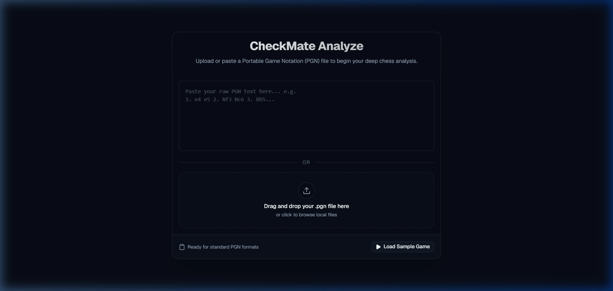
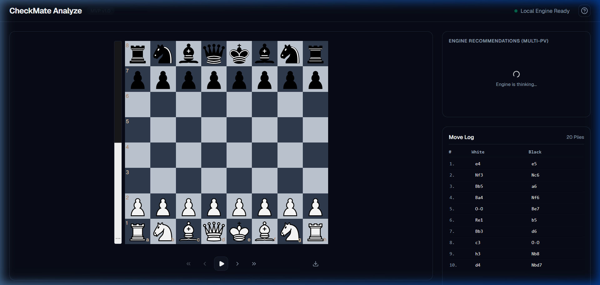
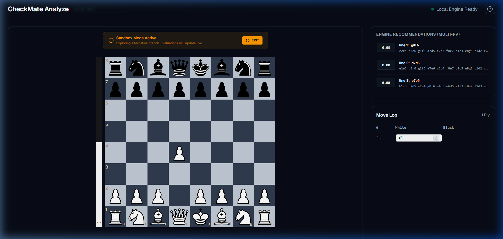
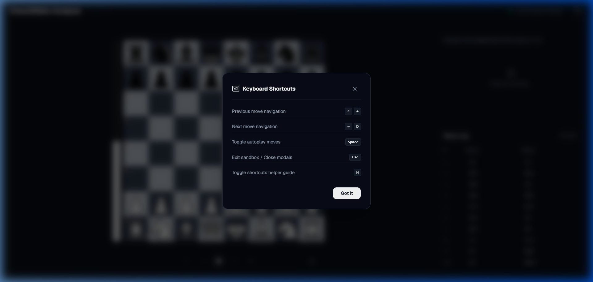
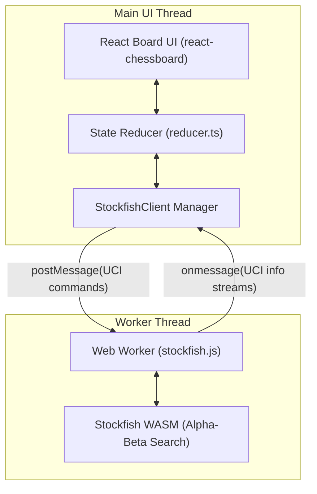

# ♟️ CheckMate Analyze 

[](https://react.dev/)
[](https://www.typescriptlang.org/)
[](https://vitejs.dev/)
[](https://tailwindcss.com/)
[](https://stockfishchess.org/)
[](https://vitest.dev/)
[](LICENSE)

CheckMate Analyze is a premium, local-first chess analysis workbench designed to treat chess games like source code: **the PGN is the program, the engine is the compiler/linter, and the user's goal is to debug their tactical mistakes.** By eliminating account walls, subscriptions, and remote server latency, CheckMate Analyze provides instant, private chess analysis executed entirely inside the client's browser.

🚀 **Live Workbench**: [check-mate-analyse.vercel.app](https://check-mate-analyse.vercel.app/)

---

## 📷 Screenshots

### 1. Landing & PGN Import Form


### 2. Main Game Analysis Workbench


### 3. Interactive Sandbox Mode


### 4. Keyboard Shortcuts Guide


---

## 🌟 Key Features

### 1. Interactive PGN Parser & Import
* Parse standard PGN files with support for headers and comments.
* Pre-loaded with a Grandmaster Sample Game (Kasparov vs. Topalov, 1999) to let you try the workbench instantly.
* Strict syntax and legality validation catches malformed or illegal moves on ingestion.

### 2. Multi-PV Stockfish Web Worker Engine
* Runs a local **Stockfish 16 WASM engine** in the browser using multi-threaded Web Workers.
* Streams **Multi-PV recommendations** (displays the top 3 alternative paths with depth, score, and principal variations).
* Accelerated with COOP/COEP isolation headers on Vercel deployment to enable SharedArrayBuffer multi-threading.

### 3. Move Classifications & Badges
* Compares played move evaluations against engine recommendations using White-perspective centipawn delta calculations.
* Classifies moves with distinct badges:
  * 👑 **Best**: Played move matches the best engine recommendation.
  * 🟢 **Excellent**: Centipawn loss is $\le 15\text{ cp}$.
  * 🔵 **Good**: Centipawn loss is between $16\text{ cp}$ and $40\text{ cp}$.
  * 🟡 **Inaccuracy**: Centipawn loss is between $41\text{ cp}$ and $100\text{ cp}$.
  * 🟠 **Mistake**: Centipawn loss is between $101\text{ cp}$ and $200\text{ cp}$.
  * 🔴 **Blunder**: Centipawn loss is $> 200\text{ cp}$.
  * ⚪ **Forced**: The only legal move available in the position.
  * 📖 **Book**: Matches known openings.

### 4. Real-time Evaluation Bar & Graph
* **Evaluation Bar**: A vertical gauge showing the relative advantage between White and Black, synchronized to the exact height of the board.
* **Evaluation Curve**: A responsive area chart visualization showing the evaluation trend of the game, letting you spot turning points instantly.

### 5. Interactive "What-If" Sandbox
* Play alternative moves on the board at any point to fork the timeline into a sandbox branch.
* Keeps the original game history immutable.
* Exit the sandbox with one click to restore the original game path.

### 6. PGN Exporter with Eval Annotations
* Compiles the analyzed game and exports it to a standard PGN file.
* Appends Stockfish evaluations directly to the moves as comments: `1. e4 { [%eval 0.15] [%cld Best] } ...`

---

## 🏗️ System Architecture & Thread Separation

To maintain a fluid interface, the CPU-heavy chess engine calculations are physically isolated from the browser's main UI thread.



### Flow Details:
* **The Interface Layer** (Board, Move List, Graph) consumes the state context and operates strictly on callbacks.
* **The Workbench Controller** handles state, validates move legality using `chess.js`, and manages the analysis lifecycle.
* **The StockfishClient** coordinates the Web Worker instance, communicating using string-based Universal Chess Interface (UCI) protocols over postMessage.

---

## ⚡ Engineering Deep-Dives

### A. Thread Isolation & 60fps UI Guarantee
Running a chess engine in the browser can easily lock up the main JavaScript thread, causing sluggish piece dragging and frozen buttons. We resolved this by delegating Stockfish WASM to a dedicated background Web Worker thread. This ensures the main UI thread stays clear to render layout updates at a constant 60fps.

### B. Navigation Interrupt Dominance
If a user rapidly traverses moves using arrow keys, the engine must not queue up calculation requests. We implemented **Interrupt Dominance**: when a new FEN is selected, the client immediately issues a `stop` command to the worker, clearing its registers and starting search on the new FEN instantly. This prevents CPU cycle pile-ups and heat throttling.

### C. Math Normalization & Mate Scaling
Standard engine scores are reported relative to the active player. To plot them on a single graph and compute move deltas, we normalize all scores to White's perspective.
Checkmate scores (e.g., mate-in-3) are mapped to a high-value spectrum (`MATE_VALUE = 20000`) and penalized based on the distance to mate:

$$V = \text{MATE\_VALUE} - (\text{plies\_to\_mate} \times 100)$$

This ensures that mate-in-1 is graded higher than mate-in-3, and that any checkmate is valued higher than any centipawn score.

---

## 📂 Project Structure

```
src/
├── components/          # Shared layout grid and statusbar
├── context/             # Global Context Store & reducer actions
├── features/            # Modular feature components
│   ├── board/           # Chessboard & BoardControls
│   ├── classification/  # Move classification badges
│   ├── engine/          # Web worker engine panels and EvalBar
│   ├── graph/           # Recharts area graph
│   ├── pgn/             # Export dialogs and LandingForm
│   ├── sandbox/         # Sandbox banner alert
│   └── shortcuts/       # Keyboard shortcut guides
├── utils/               # Parsers, classifiers, and stockfish client
└── test/                # Unit & integration test suites
```

---

## 🚀 Local Installation & Setup

1. **Clone the repository**:
   ```bash
   git clone https://github.com/vaibhv19/Check-Mate-Analyse.git
   cd Check-Mate-Analyse
   ```

2. **Install dependencies**:
   ```bash
   npm install
   ```

3. **Start local development server**:
   ```bash
   npm run dev
   ```
   Open `http://localhost:5173/` in your browser.

4. **Build production bundle**:
   ```bash
   npm run build
   ```

5. **Run Lint and Formatting checks**:
   ```bash
   npm run lint
   npm run format:check
   ```

---

## 🧪 Running Tests

The project includes unit and integration tests verifying parsers, classification deltas, board navigation, and sandbox transitions.

To execute tests with **Vitest**:
```bash
npm run test
```

---

## 📄 License

This project is licensed under the [MIT License](LICENSE).
